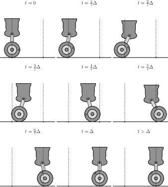

Allgemeines
===========

Das Paket MSRM stellt Software-Routinen zur **m**odellbasierten **S**teuerung und
**R**egelung eines **m**echanischen Systems zur Verfügung, am Beispiel eines von Natur
aus instabilen Fahrzeugs. Alle dafür notwendigen Schritte (Modellbildung,
Steuerungsentwurf (Planung einer Solltrajektorie), Reglerentwurf, Simulation
und Visualisierung) sind jeweils als einzelnes Python-Skript angelegt, die
unabhängig von einander ausgeführt und bearbeitet werden können.

Ergebnis ist eine Animation für die Ruhelagenüberführung:

Installationshinweise
=====================
Für die Ausführung der Skripte müssen folgende Sofware-Pakete installiert
sein:

- python3.x (getestet mit python3.6)
- numpy
- scipy
- sympy
- matplotlib

Auf Windows-Plattformen empfiehlt sich die Installation einer geeigneten python-
distribution, wie z.B.:
pythonxy, http://code.google.com/p/pythonxy/
winpython, http://code.google.com/p/winpython/

Schellstart
===========

Ausführung folgender Python-Skripte, unter Beachtung der Reihenfolge:

- `python3 model.py`
- `python3 open_loop.py`
- `python3 closed_loop.py`
- `python3 simulation.py`
- `python3 visualization.py`

Kontakt
=======
Fehlerberichte, Verbesserungsvorschläge etc. bitte per Email an
Carsten.Knoll (ät) tu-dresden.de

